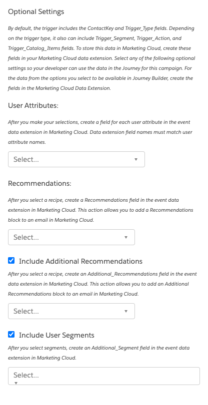

### Journey Builder

This is a Server Global Template. When used in a Trigger Campaign it reutnrs Trigger_Type and depending on the trigger type, it also can include Trigger_Segment, Trigger_Action, and Trigger_Catalog_Items fields along with other information chosen by the Campaign Developer.

#### Configuration:

1. User Attributes
2. Recommendations
3. Include Additional Recommendations
4. Include User Segments